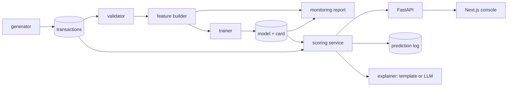

# Architecture and design decisions

## Flow

| Package | Responsibility |
|---|---|
| `app/controllers/data_generation` | Seeded synthetic data in the assignment schema |
| `app/controllers/validation` | Schema, type, required-value, range and missing-rate checks |
| `app/controllers/features` | Point-in-time features; the single implementation used for training and serving |
| `app/controllers/training` | Candidate models, selection, calibration, thresholds, model artefact |
| `app/controllers/evaluation` | Ranking, operating-point and business metrics; bootstrap intervals |
| `app/controllers/monitoring` | PSI / KS statistics and the monthly drift report with actions |
| `app/controllers/explanations` | Template and optional LLM explanations |
| `app/controllers/scoring` | Online scoring service and API routes |
| `app/utils` | Config, JSON logging, Prometheus metrics |

## Data

The provided CSV has 12 rows: enough to learn the schema, not to train. The generator
simulates devices with their own spending level, favourite merchants, payment method and
active hours, then injects four fraud patterns (account-takeover bursts, mule devices,
stealth fraud, and a UPI scam pattern that only starts in mid-July). It also plants
genuine behaviour that looks suspicious (large purchases, quick repeats, retries, night
owls) so that precision is not trivially high, and drift in July-September so that the
monitoring section has something to find.

Consequence: every metric in this repository measures how well the model recovers
patterns that were simulated. They say nothing about performance on real traffic.

## Time windows

| Window | Dates | Use |
|---|---|---|
| Warm-up | 1-30 Jan | Feature history only |
| Train | 31 Jan - 30 Apr | Fit |
| Validation | 8-31 May | Model selection, calibration, thresholds |
| Test | 8-30 Jun | Reported once; the release baseline |
| Live | Jul - Sep | Monitoring |

The split is by time because fraud behaviour and the behavioural features both evolve;
a random split would let the model train on the future. The 7-day gaps before validation
and test mirror the label delay: when a window starts, the labels of the preceding week
would not have arrived yet.

## Features

All behavioural features use only transactions strictly earlier than the one being scored.

- **Time**: hour, day of week, night and weekend flags, cyclical hour.
- **Amount**: log amount, round-amount flag, z-score and ratio against the device's last
  30 days, z-score against the merchant's last 30 days.
- **Device**: counts over 10 minutes, 1 hour, 24 hours, 7 days and 30 days; amount sums;
  seconds since the previous payment; device age; first payment to this merchant or with
  this payment method in 30 days; new merchants in 24 hours; earlier failed or declined
  attempts.
- **Merchant**: hourly and 30-day volume; fraud rate over the 30 days of labels that have
  matured (older than the 7-day label delay), smoothed towards a prior.
- **Categorical**: payment method, merchant risk tier, MCC, issuer bank, merchant state.

Two decisions worth noting:

1. **Fixed lookbacks instead of full history.** A first version compared each amount with
   the device's entire history. Those features drift by construction, because history
   only grows, and they raised drift alerts in July with nothing wrong. Bounded windows
   are stationary and match what a feature store can actually retain.
2. **`request_status` of the current payment is excluded.** It is the outcome of the
   payment and is not known when the fraud decision is made. In the data it correlates
   with fraud, so using it would inflate offline metrics and then be unavailable (or
   different) in production. The status of *earlier* payments is a legitimate signal and
   is used.

Fields not fed to the model directly: `request_id` (unique), `device_id` and `merchant_id`
(identifiers the model would memorise; used only to build history), `merchant_city`
(redundant with state), `mcc_title` (duplicate of code), `currency_code` (constant).

## Model choice

- **Baseline**: Logistic Regression with median imputation plus missing indicators,
  signed-log transform, scaling and one-hot encoding.
- **Champion**: `HistGradientBoostingClassifier`. Fraud signals here are interactions
  (a large amount matters more on a new merchant at night), which trees capture without
  hand-built crosses. It handles missing values and categoricals natively and needs no
  system libraries.

Selection is by PR-AUC on the validation window.

## Class imbalance

Fraud is about 1% of transactions. The approach is **no resampling**: compare no weighting,
square-root class weights and fully balanced weights, choose on validation PR-AUC, then
set the operating point with thresholds.

Reasons: for strong learners such as gradient boosting, rebalancing does not improve
ranking and distorts the predicted probabilities (Elor & Averbuch-Elor 2022; van den
Goorbergh et al. 2022). The results in this repository agree: the three weightings are
within noise of each other on PR-AUC, and balanced weights give a clearly worse
uncalibrated Brier score. Imbalance is a decision-threshold problem more than a training
problem, so the effort goes into the threshold.

Scores are then Platt-calibrated on the validation window. The calibration is strictly
monotone, so it never changes the ranking.

## Decision policy: keeping false positives low

One threshold forces a single trade-off between missed fraud and blocked customers. Two
thresholds separate the cheap action from the expensive one:

| Band | Rule on validation | Action | Cost of a false positive |
|---|---|---|---|
| Block | precision >= 95% | Decline automatically | A lost genuine sale and an annoyed customer |
| Review | precision >= 50% | Manual review or step-up authentication | A few minutes of analyst time |
| Approve | everything else | Pay | |

Both thresholds are the lowest score that meets the precision floor, which maximises
recall under that constraint. They are chosen on validation and frozen before the test
window is touched.

## Metrics

PR-AUC is the headline ranking metric: with 1% fraud, ROC-AUC is dominated by the easy
negatives and looks excellent for mediocre models (Davis & Goadrich 2006; Saito &
Rehmsmeier 2015). The baseline PR-AUC is the fraud rate, so it reads as lift.

For the operating point, the metric that matters is **recall at a fixed precision** (or
equivalently at a fixed false-positive budget), because that is the decision the business
actually makes: how much fraud can we stop for a given number of customers inconvenienced.
Accuracy is not reported as a goal: approving everything scores about 99%.

## Serving

`ScoringService` reuses `build_features` on the slice of history that can affect one
transaction: the device's rows and the merchant's last 37 days. There is one feature
implementation, so training/serving skew cannot come from duplicated logic; an
integration test replays stored transactions through the API and checks the score matches
the batch score. History is held in memory here; production would use an online feature
store with the same retention.

## References

- Le Borgne, Siblini, Lebichot, Bontempi (2022). *Reproducible Machine Learning for Credit Card Fraud Detection - Practical Handbook*. https://fraud-detection-handbook.github.io/fraud-detection-handbook/
- Dal Pozzolo, Boracchi, Caelen, Alippi, Bontempi (2018). Credit card fraud detection: a realistic modeling and a novel learning strategy. *IEEE TNNLS* 29(8).
- Correa Bahnsen, Aouada, Stojanovic, Ottersten (2016). Feature engineering strategies for credit card fraud detection. *Expert Systems with Applications* 51.
- Elor, Averbuch-Elor (2022). To SMOTE, or not to SMOTE? arXiv:2201.08528.
- van den Goorbergh, van Smeden, Timmerman, Van Calster (2022). The harm of class imbalance corrections for risk prediction models. *JAMIA* 29(9).
- Davis, Goadrich (2006). The relationship between Precision-Recall and ROC curves. *ICML*.
- Saito, Rehmsmeier (2015). The precision-recall plot is more informative than the ROC plot when evaluating binary classifiers on imbalanced datasets. *PLoS ONE* 10(3).
- Elkan (2001). The foundations of cost-sensitive learning. *IJCAI*.
- Yurdakul (2018). *Statistical Properties of Population Stability Index*. PhD dissertation, Western Michigan University.
- Gama, Zliobaite, Bifet, Pechenizkiy, Bouchachia (2014). A survey on concept drift adaptation. *ACM Computing Surveys* 46(4).
